# Visual proofs — vocabulary-entry before/after gallery

> Side-by-side renders of the synthetic ColorChecker chart and the synthetic grayscale ramp, before and after each vocabulary entry. For human visual validation: does each primitive *visibly* do what its description claims?

> Renders use an **empty-history baseline** + ``--apply-custom-presets false`` so the chart passes through the darktable pipeline cleanly (input profile → output profile only, no scene-referred tone mapping). Each primitive is then applied in isolation — the only difference between baseline and per-entry renders is *that primitive's effect*. This lets you eyeball each primitive against the reference chart and verify it does what its description claims.

> Production raw renders use the full ``_baseline_v1.xmp`` with sigmoid + colorbalancergb defaults — that path is correct for raws. The empty-baseline trick is specifically for chart-input isolation testing; it would not be appropriate for editing real photographs.

> **Masked columns**: every non-mask-bound primitive renders additionally through a centered ellipse mask (``radius=0.2``, ``border=0.05``) so you can see the spatial shaping in action. The mask covers the middle 16% of the frame; anything outside it should remain at baseline. This visually demonstrates that **any** primitive can be applied through a mask — see [`mask-applicable-controls.md`](mask-applicable-controls.md) for the per-module compatibility matrix.

> **Auto-generated.** Regenerate via ``uv run python scripts/generate-visual-proofs.py`` after vocabulary changes. Commit the regenerated images alongside any vocabulary commit so the gallery and the manifest stay in sync.

> Render size: 400x400, JPEG quality default. Inputs: synthetic targets from [`tests/fixtures/reference-targets/`](https://github.com/chipi/chemigram/blob/main/tests/fixtures/reference-targets/README.md).

> **🎯 Trust basis — what the chart can and can't verify.** The synthetic chart is a legitimate fixture for entries whose touched darktable modules operate on already-developed sRGB / working-profile pixels (`exposure`, `sigmoid`, `bilat`, `vignette`, `grain`, `sharpen`, single-axis `colorbalancergb` shifts, `channelmixerrgb` in destination=grey mode, `highlights`, `toneequal`). For these — listed in the **Chart-verifiable** sections below — the after-image shows exactly what the entry does. Trust it.

> Entries that touch raw-domain modules (`colorequal`, `denoiseprofile`, `lens`, `hazeremoval`, `ashift`, `crop`, `retouch`, `filmicrgb`, `diffuse`) can't be honestly verified against a synthetic sRGB chart — those modules need the full raw → input-profile → working-profile pipeline. Such entries render against a CC BY-SA real-raw fixture in the **Real-raw entries** section below.

> A separate **Not yet honestly verifiable** section lists entries touching `temperature` — the chemigram apply path doesn't yet compute camera-correct WB coefficients per raw at apply time, so those entries' dtstyle blobs carry foreign-camera coefficients that produce a visible cast on any non-matching body. Tracked in [#131](https://github.com/chipi/chemigram/issues/131) Step 2 / RFC-039 (raw-derived parameters in L2 composition). The module-level discriminator lives at `src/chemigram/core/visual_verification.py`.

> **📷 Real-raw fixtures (#130).** Entries that touch raw-domain modules render against one of two CC BY-SA 4.0 fixtures from [discuss.pixls.us](https://discuss.pixls.us): `landscape.ARW` (Sony DSC-RX10M4 — sky, foliage, water, horizon) or `portrait.ARW` (Sony ZV-E10 — indoor single subject). Routing per entry by name heuristic — skin/face/eye/portrait/subject/hair → portrait; everything else → landscape. See [`tests/fixtures/raws/README.md`](https://github.com/chipi/chemigram/blob/main/tests/fixtures/raws/README.md) for provenance, license, and attribution.

---

## Baseline reference

These are the reference targets rendered through the baseline XMP with no primitive applied — the *before* state every row below compares against.

| ColorChecker | Grayscale ramp |
|-|-|
| 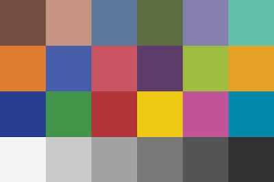 | 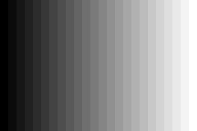 |

---

## `starter` pack — 3 entries (0 chart-verifiable, 3 real-raw, 0 not-yet-portable)

### Real-raw entries

These entries touch raw-domain darktable modules (`colorequal`, `denoiseprofile`, `lens`, `hazeremoval`, `ashift`, `crop`, `retouch`, `filmicrgb`, `diffuse`) — or compose looks that include one. The synthetic chart can't represent the input these modules expect; rendering against it produces structurally-misleading output. Each entry is routed to either the landscape or portrait CC BY-SA 4.0 fixture from `tests/fixtures/raws/` so the after-image is honest. Apply-path correctness is independently verified by the unit + integration + e2e test coverage.

### `wb_kelvin_delta` 📷 landscape raw

_WB Kelvin / tint UX wrapper (#102). Same temperature module as the temperature entry, but exposes photographic units instead of raw RGB coefficients. 2 axes: --param kelvin_delta=V (range [-3000, 3000]; positive = warmer) and --param tint_delta=V (range [-200, 200]; positive = magenta-shifted). Linear approximation: red_coeff *= 1 + kelvin_delta * 0.0001, blue_coeff inverse, green_coeff *= 1 + tint_delta * 0.0001. Daily-use accurate; not chromatic-adaptation-perfect. RFC-039 / #131 made apply path camera-aware: at non-zero delta, shifts are relative to the target raw's camera-default WB read via rawpy._

> 📷 **Real-raw rendering** (fixture: `landscape.ARW`, CC BY-SA 4.0). This entry touches a raw-domain darktable module that needs the full input-profile chain. Rendered against the landscape fixture so the after-image is honest. Apply-path correctness is independently verified by the unit + integration + e2e test coverage. See `tests/fixtures/raws/README.md` for provenance and attribution.

| Landscape raw |
|-|
| 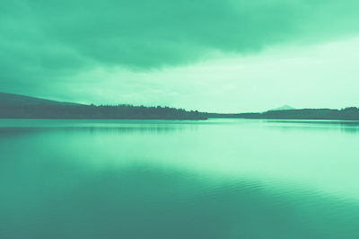 |

### `wb_warm_subtle` 📷 landscape raw

_Warm white balance, subtle. Reauthored RFC-039 / #137 to compose wb_kelvin_delta with a fixed +500K shift; camera-portable._

> 📷 **Real-raw rendering** (fixture: `landscape.ARW`, CC BY-SA 4.0). This entry touches a raw-domain darktable module that needs the full input-profile chain. Rendered against the landscape fixture so the after-image is honest. Apply-path correctness is independently verified by the unit + integration + e2e test coverage. See `tests/fixtures/raws/README.md` for provenance and attribution.

| Landscape raw |
|-|
| 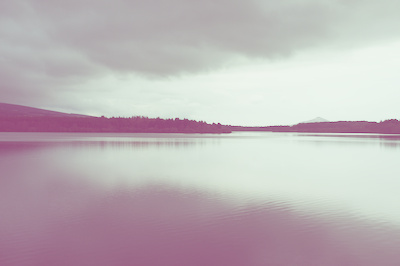 |

### `look_neutral` 📷 landscape raw

_Neutral L2 look — exposure + warm-subtle WB baseline. Reauthored RFC-039 / #137 to compose wb_kelvin_delta (no shift at default); camera-portable._

> 📷 **Real-raw rendering** (fixture: `landscape.ARW`, CC BY-SA 4.0). This entry touches a raw-domain darktable module that needs the full input-profile chain. Rendered against the landscape fixture so the after-image is honest. Apply-path correctness is independently verified by the unit + integration + e2e test coverage. See `tests/fixtures/raws/README.md` for provenance and attribution.

| Landscape raw |
|-|
| 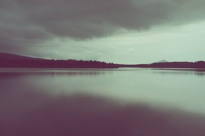 |

---

## `expressive-baseline` pack — 111 entries (76 chart-verifiable, 35 real-raw, 0 not-yet-portable)

### Chart-verifiable entries

These entries' touched darktable modules operate on already-developed sRGB / working-profile pixels. The chart is an honest fixture; the after-image shows exactly what the entry does in that pixel domain. Trust the result.

### `grain_strength`

_Parameterized grain strength (RFC-021). Pass --value V; range [0.0, 100.0]. 8 = grain_fine-equivalent, 25 = grain_medium-equivalent, 50 = grain_heavy-equivalent. Replaces the v1.5.x discrete grain_fine / grain_medium / grain_heavy entries with a single continuous-magnitude primitive._

> ⚙️ **Main row = parametric default (identity).** This entry's default parameter value is the identity (no-op); the main row below shows the unchanged input by design. See the **parameter sweep** lower down for what the entry does at non-default values.

| ColorChecker (global) | Grayscale (global) | ColorChecker (centered ellipse mask) | Grayscale (centered ellipse mask) |
|-|-|-|-|
|  |  |  |  |

**On the clipped-gradient fixture** (continuous tone + blown highlights — chart designed to show this module's effect; see [`reference-targets/README.md`](https://github.com/chipi/chemigram/blob/main/tests/fixtures/reference-targets/README.md)):

| Clipped gradient (global) | Clipped gradient (centered ellipse mask) |
|-|-|
|  | 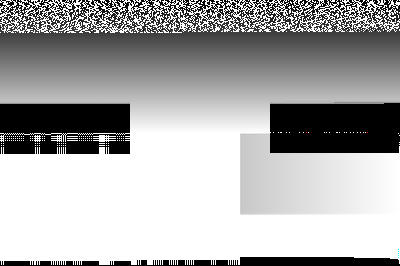 |

### `vignette`

_Parameterized vignette (RFC-021). Pass --value V (CLI) or value: V (MCP); range [-1.0, +1.0] (negative darkens corners; positive lifts). Replaces the v1.5.x discrete vignette_subtle / vignette_medium / vignette_heavy entries with a single continuous-magnitude primitive._

| ColorChecker (global) | Grayscale (global) | ColorChecker (centered ellipse mask) | Grayscale (centered ellipse mask) |
|-|-|-|-|
| 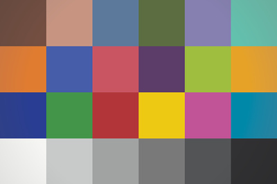 | 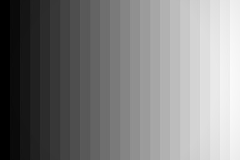 | _(n/a)_ | _(n/a)_ |

### `highlights_clip_threshold`

_Parameterized highlight-recovery clip threshold (RFC-021). Pass --value V; range [0.0, 2.0]: lower = more aggressive recovery (0.95 = subtle, 0.85 = strong, 0.5 = aggressive). Default 1.0 (darktable default; recovers only above 1.0). Replaces the v1.5.x discrete highlights_recovery_subtle / highlights_recovery_strong entries._

> ⚙️ **Main row = parametric default (identity).** This entry's default parameter value is the identity (no-op); the main row below shows the unchanged input by design. See the **parameter sweep** lower down for what the entry does at non-default values.

| ColorChecker (global) | Grayscale (global) | ColorChecker (centered ellipse mask) | Grayscale (centered ellipse mask) |
|-|-|-|-|
|  |  |  |  |

**On the clipped-gradient fixture** (continuous tone + blown highlights — chart designed to show this module's effect; see [`reference-targets/README.md`](https://github.com/chipi/chemigram/blob/main/tests/fixtures/reference-targets/README.md)):

| Clipped gradient (global) | Clipped gradient (centered ellipse mask) |
|-|-|
| 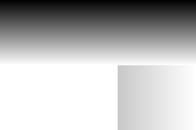 |  |

### `sigmoid_contrast`

_Parameterized sigmoid tone-curve contrast (RFC-021). Pass --value V (CLI) or value: V (MCP); range [0.5, 5.0] (1.0 = mild s-curve, 1.5 = darktable default / no curve change, 2.5 = aggressive s-curve). Replaces the v1.5.x discrete contrast_low / contrast_high entries with a single continuous-magnitude primitive._

| ColorChecker (global) | Grayscale (global) | ColorChecker (centered ellipse mask) | Grayscale (centered ellipse mask) |
|-|-|-|-|
| 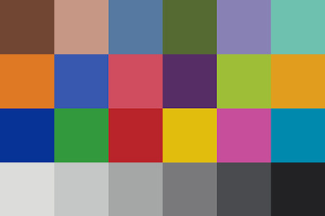 |  | 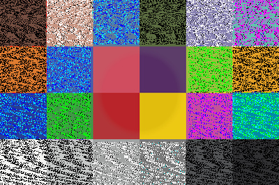 | 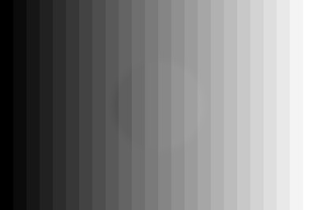 |

### `blacks_lifted`

_Lift target black to 0.5._

| ColorChecker (global) | Grayscale (global) | ColorChecker (centered ellipse mask) | Grayscale (centered ellipse mask) |
|-|-|-|-|
| 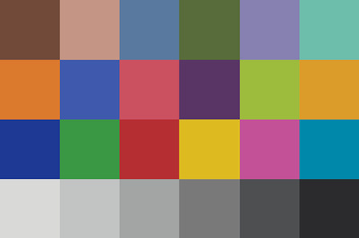 |  | 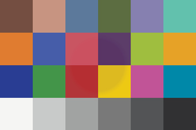 | 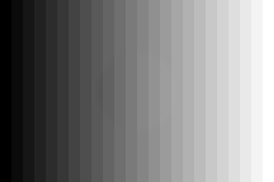 |

**On the clipped-gradient fixture** (continuous tone + blown highlights — chart designed to show this module's effect; see [`reference-targets/README.md`](https://github.com/chipi/chemigram/blob/main/tests/fixtures/reference-targets/README.md)):

| Clipped gradient (global) |
|-|
| 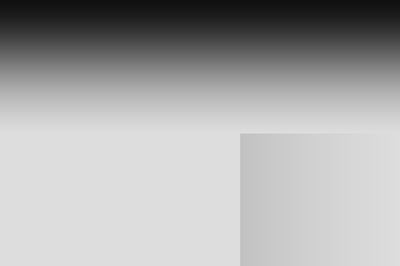 |

### `blacks_crushed`

_Crush blacks: target 0.001 + skew -0.3._

| ColorChecker (global) | Grayscale (global) | ColorChecker (centered ellipse mask) | Grayscale (centered ellipse mask) |
|-|-|-|-|
| 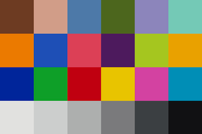 |  | 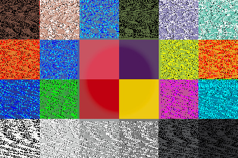 | 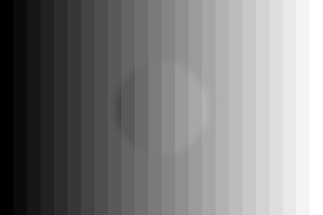 |

**On the clipped-gradient fixture** (continuous tone + blown highlights — chart designed to show this module's effect; see [`reference-targets/README.md`](https://github.com/chipi/chemigram/blob/main/tests/fixtures/reference-targets/README.md)):

| Clipped gradient (global) |
|-|
| 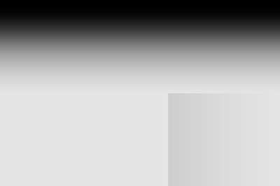 |

### `whites_open`

_Open whites: target 300 (3x default)._

| ColorChecker (global) | Grayscale (global) | ColorChecker (centered ellipse mask) | Grayscale (centered ellipse mask) |
|-|-|-|-|
| 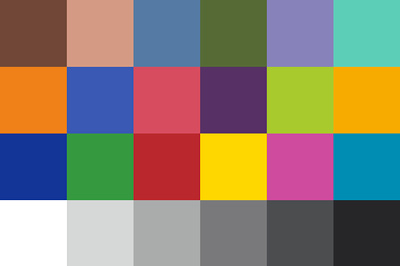 | 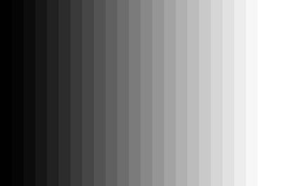 | 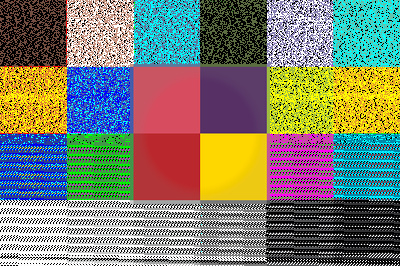 | 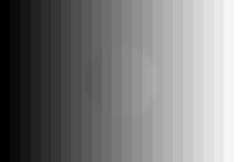 |

### `bw_sky_drama`

_B&W with sky-drama mix (red-emphasis: R 0.5 / G 0.4 / B 0.1). Lightens reds and darkens blues — classic 'red filter' landscape look that emphasizes clouds against sky. normalize_grey=true._

| ColorChecker (global) | Grayscale (global) | ColorChecker (centered ellipse mask) | Grayscale (centered ellipse mask) |
|-|-|-|-|
| 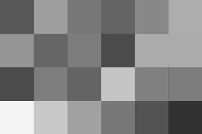 | 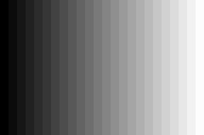 | 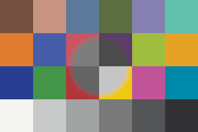 | 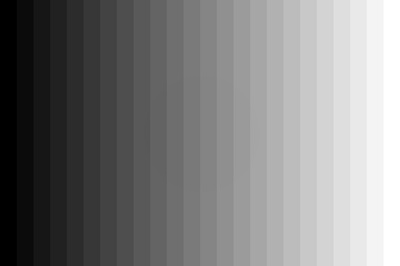 |

**On the landscape raw fixture** (real-raw content matching this entry's `requires_content` tags; the chart's module-level signal is honest, but the content-level payoff shows here):

| Landscape raw |
|-|
| 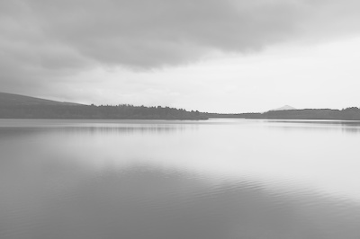 |

### `bw_foliage`

_B&W with foliage mix (green-emphasis: R 0.1 / G 0.7 / B 0.2). Lightens greens — separates foliage from neighboring tones; useful for forest / botanical work where green is the dominant subject. normalize_grey=true._

| ColorChecker (global) | Grayscale (global) | ColorChecker (centered ellipse mask) | Grayscale (centered ellipse mask) |
|-|-|-|-|
| 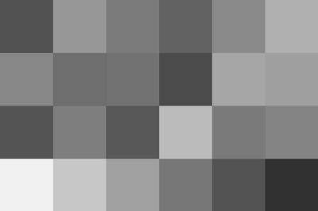 |  | 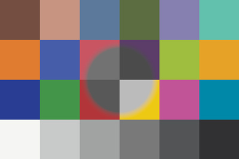 | 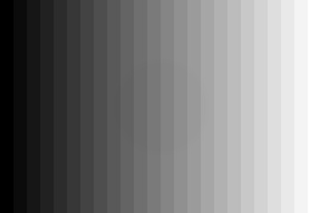 |

**On the landscape raw fixture** (real-raw content matching this entry's `requires_content` tags; the chart's module-level signal is honest, but the content-level payoff shows here):

| Landscape raw |
|-|
| 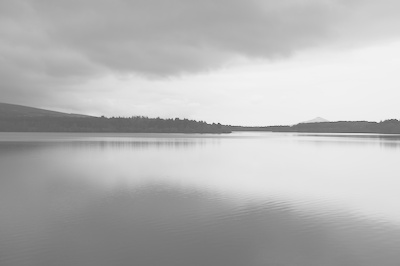 |

### `toneequalizer`

_Parameterized 9-band tone equalizer (RFC-022 Tier 2; most complex multi-parameter ship). Pass --param NODE=V for any of: noise, ultra_deep_blacks, deep_blacks, blacks, shadows, midtones, highlights, whites, speculars. Each in [-2.0, +2.0] EV; default 0.0. Algorithm fields preserved at darktable defaults._

> ⚙️ **Main row = parametric default (identity).** This entry's default parameter value is the identity (no-op); the main row below shows the unchanged input by design. See the **parameter sweep** lower down for what the entry does at non-default values.

| ColorChecker (global) | Grayscale (global) | ColorChecker (centered ellipse mask) | Grayscale (centered ellipse mask) |
|-|-|-|-|
| 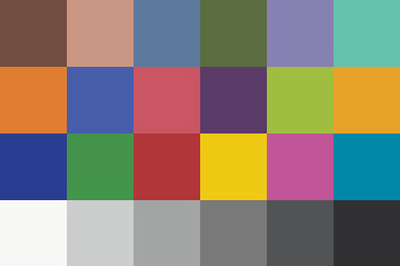 |  | 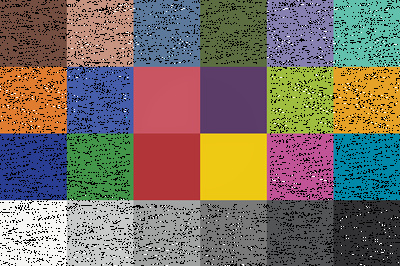 | 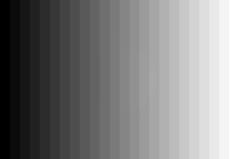 |

### `sharpen`

_Parameterized sharpening (RFC-022 Tier 2). Pass --value V; range [0.0, 2.0] (0.0 = no sharpen, 0.5 = subtle, 1.0 = strong, 2.0 = aggressive). Radius preserved at darktable default 2.0 px, threshold at 0.5._

> ⚙️ **Main row = parametric default (identity).** This entry's default parameter value is the identity (no-op); the main row below shows the unchanged input by design. See the **parameter sweep** lower down for what the entry does at non-default values.

| ColorChecker (global) | Grayscale (global) | ColorChecker (centered ellipse mask) | Grayscale (centered ellipse mask) |
|-|-|-|-|
|  |  |  |  |

### `bilat_clarity_strength`

_Parameterized clarity strength on bilat / local laplacian (RFC-021). Pass --value V; range [-1.0, 4.0]. 1.5 = clarity_strong-equivalent. clarity_painterly stays as a separate discrete entry — different kind, not strength._

> ⚙️ **Main row = parametric default (identity).** This entry's default parameter value is the identity (no-op); the main row below shows the unchanged input by design. See the **parameter sweep** lower down for what the entry does at non-default values.

| ColorChecker (global) | Grayscale (global) | ColorChecker (centered ellipse mask) | Grayscale (centered ellipse mask) |
|-|-|-|-|
| 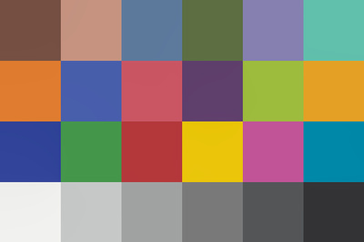 |  | 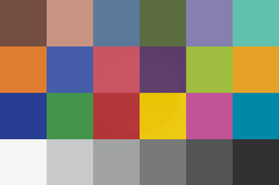 | 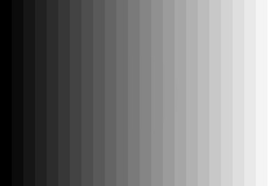 |

### `clarity_painterly`

_Soft painterly local contrast (detail 0.4)._

| ColorChecker (global) | Grayscale (global) | ColorChecker (centered ellipse mask) | Grayscale (centered ellipse mask) |
|-|-|-|-|
| 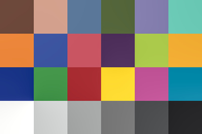 | 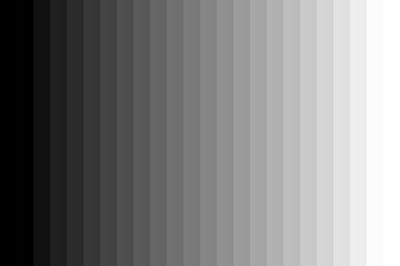 | 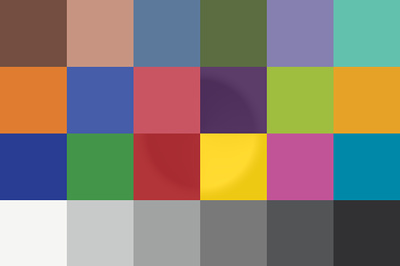 | 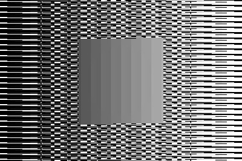 |

### `clarity_etched`

_L3 discrete kind — etched / over-defined clarity (#110). bilat_clarity_strength=2.0 (high local-contrast bite)._

| ColorChecker (global) | Grayscale (global) | ColorChecker (centered ellipse mask) | Grayscale (centered ellipse mask) |
|-|-|-|-|
| 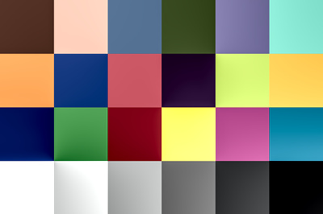 | 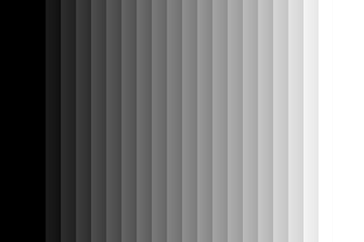 | 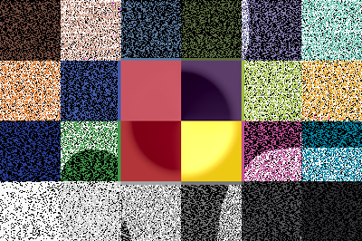 | 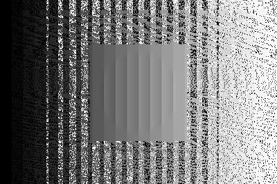 |

### `clarity_dreamy`

_L3 discrete kind — soft / dreamy clarity (#110). bilat_clarity_strength=-0.5 (negative bite — softens local contrast)._

| ColorChecker (global) | Grayscale (global) | ColorChecker (centered ellipse mask) | Grayscale (centered ellipse mask) |
|-|-|-|-|
| 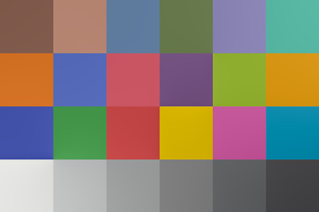 |  | 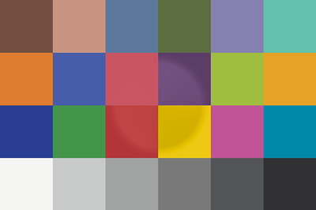 | 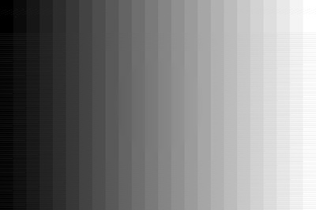 |

### `sharpen_edge_only`

_L3 discrete kind — edge-only sharpening (#110). amount=0.6 with default radius (2.0 px) and threshold (0.5). Threshold gates sharpening to detected edges only._

| ColorChecker (global) | Grayscale (global) | ColorChecker (centered ellipse mask) | Grayscale (centered ellipse mask) |
|-|-|-|-|
|  |  |  |  |

### `sharpen_overall`

_L3 discrete kind — whole-image sharpening with bite (#110). amount=1.2 (strong)._

| ColorChecker (global) | Grayscale (global) | ColorChecker (centered ellipse mask) | Grayscale (centered ellipse mask) |
|-|-|-|-|
|  |  |  |  |

### `vignette_subtle`

_L3 discrete kind — gentle peripheral darkening (#110). brightness=-0.15._

| ColorChecker (global) | Grayscale (global) | ColorChecker (centered ellipse mask) | Grayscale (centered ellipse mask) |
|-|-|-|-|
|  |  | _(n/a)_ | _(n/a)_ |

### `vignette_strong`

_L3 discrete kind — pronounced peripheral darkening (#110). brightness=-0.5._

| ColorChecker (global) | Grayscale (global) | ColorChecker (centered ellipse mask) | Grayscale (centered ellipse mask) |
|-|-|-|-|
|  |  | _(n/a)_ | _(n/a)_ |

### `exposure`

_Parameterized exposure compensation (RFC-021). Pass --value V (CLI) or value: V (MCP) in EV stops; range [-3.0, +3.0]. Replaces the v1.5.x discrete expo_+0.3 / expo_+0.5 / expo_-0.3 / expo_-0.5 / shadows_global_+/- entries with a single continuous-magnitude primitive._

> ⚙️ **Main row = parametric default (identity).** This entry's default parameter value is the identity (no-op); the main row below shows the unchanged input by design. See the **parameter sweep** lower down for what the entry does at non-default values.

| ColorChecker (global) | Grayscale (global) | ColorChecker (centered ellipse mask) | Grayscale (centered ellipse mask) |
|-|-|-|-|
|  |  |  |  |

### `saturation_global`

_Parameterized global saturation in colorbalancergb (RFC-021). Pass --value V (CLI) or value: V (MCP); range [-1.0, +1.0] (-1.0 = fully desaturated / monochrome; +0.5 = strong boost). Replaces the v1.5.x discrete sat_kill / sat_boost_moderate / sat_boost_strong entries with a single continuous-magnitude primitive._

> ⚙️ **Main row = parametric default (identity).** This entry's default parameter value is the identity (no-op); the main row below shows the unchanged input by design. See the **parameter sweep** lower down for what the entry does at non-default values.

| ColorChecker (global) | Grayscale (global) | ColorChecker (centered ellipse mask) | Grayscale (centered ellipse mask) |
|-|-|-|-|
|  | _(n/a)_ |  | _(n/a)_ |

### `vibrance`

_Parameterized vibrance on colorbalancergb (RFC-022 Tier 2). Pass --value V; range [-1.0, +1.0]. 0.3 = vibrance_+0.3-equivalent. Vibrance protects already-saturated pixels — gentler chroma push than saturation_global. Replaces v1.5.x vibrance_+0.3._

> ⚙️ **Main row = parametric default (identity).** This entry's default parameter value is the identity (no-op); the main row below shows the unchanged input by design. See the **parameter sweep** lower down for what the entry does at non-default values.

| ColorChecker (global) | Grayscale (global) | ColorChecker (centered ellipse mask) | Grayscale (centered ellipse mask) |
|-|-|-|-|
|  | _(n/a)_ |  | _(n/a)_ |

### `chroma_global`

_Parameterized global chroma on colorbalancergb (RFC-022 Tier 2). Pass --value V; range [-1.0, +1.0]. Less saturated-pixel protection than vibrance, more aggressive than saturation_global at equal magnitudes._

> ⚙️ **Main row = parametric default (identity).** This entry's default parameter value is the identity (no-op); the main row below shows the unchanged input by design. See the **parameter sweep** lower down for what the entry does at non-default values.

| ColorChecker (global) | Grayscale (global) | ColorChecker (centered ellipse mask) | Grayscale (centered ellipse mask) |
|-|-|-|-|
|  | _(n/a)_ |  | _(n/a)_ |

### `hue_angle`

_Parameterized global hue rotation on colorbalancergb (RFC-022 Tier 2). Pass --value V in degrees; range [-180.0, +180.0]. Rotates every pixel's hue around the color wheel without changing saturation or luminance._

> ⚙️ **Main row = parametric default (identity).** This entry's default parameter value is the identity (no-op); the main row below shows the unchanged input by design. See the **parameter sweep** lower down for what the entry does at non-default values.

| ColorChecker (global) | Grayscale (global) | ColorChecker (centered ellipse mask) | Grayscale (centered ellipse mask) |
|-|-|-|-|
|  |  |  |  |

### `brilliance_global`

_Parameterized global brilliance on colorbalancergb (RFC-022 Tier 2 / #86). Pass --value V; range [-1.0, +1.0]. Brilliance shapes per-zone luminance — the global axis moves all zones together. Per-zone variants (highlights/midtones/shadows) target specific tonal ranges._

> ⚙️ **Main row = parametric default (identity).** This entry's default parameter value is the identity (no-op); the main row below shows the unchanged input by design. See the **parameter sweep** lower down for what the entry does at non-default values.

| ColorChecker (global) | Grayscale (global) | ColorChecker (centered ellipse mask) | Grayscale (centered ellipse mask) |
|-|-|-|-|
|  |  |  |  |

### `brilliance_highlights`

_Parameterized highlight-zone brilliance on colorbalancergb (RFC-022 Tier 2 / #86). Pass --value V; range [-1.0, +1.0]. Targets only the highlight tonal zone — useful for selectively brightening or compressing high-key areas without affecting shadows / midtones._

> ⚙️ **Main row = parametric default (identity).** This entry's default parameter value is the identity (no-op); the main row below shows the unchanged input by design. See the **parameter sweep** lower down for what the entry does at non-default values.

| ColorChecker (global) | Grayscale (global) | ColorChecker (centered ellipse mask) | Grayscale (centered ellipse mask) |
|-|-|-|-|
|  |  |  |  |

### `brilliance_midtones`

_Parameterized midtone-zone brilliance on colorbalancergb (RFC-022 Tier 2 / #86). Pass --value V; range [-1.0, +1.0]. Targets only the midtone tonal zone — selectively shapes the body of the tonal distribution._

> ⚙️ **Main row = parametric default (identity).** This entry's default parameter value is the identity (no-op); the main row below shows the unchanged input by design. See the **parameter sweep** lower down for what the entry does at non-default values.

| ColorChecker (global) | Grayscale (global) | ColorChecker (centered ellipse mask) | Grayscale (centered ellipse mask) |
|-|-|-|-|
|  |  |  |  |

### `brilliance_shadows`

_Parameterized shadow-zone brilliance on colorbalancergb (RFC-022 Tier 2 / #86). Pass --value V; range [-1.0, +1.0]. Targets only the shadow tonal zone — selectively lifts or deepens dark areas without affecting highlights / midtones._

> ⚙️ **Main row = parametric default (identity).** This entry's default parameter value is the identity (no-op); the main row below shows the unchanged input by design. See the **parameter sweep** lower down for what the entry does at non-default values.

| ColorChecker (global) | Grayscale (global) | ColorChecker (centered ellipse mask) | Grayscale (centered ellipse mask) |
|-|-|-|-|
|  |  |  |  |

### `hue_shadows`

_Parameterized per-zone hue rotation for shadows (#91 Bucket A.5; Lightroom Color Grading shadows wheel). Pass --value V; range [0.0, 360.0] degrees. Default 0.0._

> ⚙️ **Main row = parametric default (identity).** This entry's default parameter value is the identity (no-op); the main row below shows the unchanged input by design. See the **parameter sweep** lower down for what the entry does at non-default values.

| ColorChecker (global) | Grayscale (global) | ColorChecker (centered ellipse mask) | Grayscale (centered ellipse mask) |
|-|-|-|-|
|  |  |  |  |

### `hue_midtones`

_Parameterized per-zone hue rotation for midtones (#91 Bucket A.5; Lightroom Color Grading midtones wheel). Pass --value V; range [0.0, 360.0] degrees. Default 0.0._

> ⚙️ **Main row = parametric default (identity).** This entry's default parameter value is the identity (no-op); the main row below shows the unchanged input by design. See the **parameter sweep** lower down for what the entry does at non-default values.

| ColorChecker (global) | Grayscale (global) | ColorChecker (centered ellipse mask) | Grayscale (centered ellipse mask) |
|-|-|-|-|
|  |  |  |  |

### `hue_highlights`

_Parameterized per-zone hue rotation for highlights (#91 Bucket A.5; Lightroom Color Grading highlights wheel). Pass --value V; range [0.0, 360.0] degrees. Default 0.0._

> ⚙️ **Main row = parametric default (identity).** This entry's default parameter value is the identity (no-op); the main row below shows the unchanged input by design. See the **parameter sweep** lower down for what the entry does at non-default values.

| ColorChecker (global) | Grayscale (global) | ColorChecker (centered ellipse mask) | Grayscale (centered ellipse mask) |
|-|-|-|-|
|  |  |  |  |

### `saturation_shadows`

_Parameterized per-zone saturation for shadows (#91 Bucket A.5; pairs with hue_shadows for full Lightroom shadow-zone color-grading control). Pass --value V; range [-1.0, +1.0]._

> ⚙️ **Main row = parametric default (identity).** This entry's default parameter value is the identity (no-op); the main row below shows the unchanged input by design. See the **parameter sweep** lower down for what the entry does at non-default values.

| ColorChecker (global) | Grayscale (global) | ColorChecker (centered ellipse mask) | Grayscale (centered ellipse mask) |
|-|-|-|-|
|  | _(n/a)_ |  | _(n/a)_ |

### `saturation_midtones`

_Parameterized per-zone saturation for midtones (#91 Bucket A.5). Pass --value V; range [-1.0, +1.0]._

> ⚙️ **Main row = parametric default (identity).** This entry's default parameter value is the identity (no-op); the main row below shows the unchanged input by design. See the **parameter sweep** lower down for what the entry does at non-default values.

| ColorChecker (global) | Grayscale (global) | ColorChecker (centered ellipse mask) | Grayscale (centered ellipse mask) |
|-|-|-|-|
|  | _(n/a)_ |  | _(n/a)_ |

### `saturation_highlights`

_Parameterized per-zone saturation for highlights (#91 Bucket A.5). Pass --value V; range [-1.0, +1.0]._

> ⚙️ **Main row = parametric default (identity).** This entry's default parameter value is the identity (no-op); the main row below shows the unchanged input by design. See the **parameter sweep** lower down for what the entry does at non-default values.

| ColorChecker (global) | Grayscale (global) | ColorChecker (centered ellipse mask) | Grayscale (centered ellipse mask) |
|-|-|-|-|
|  | _(n/a)_ |  | _(n/a)_ |

### `shadows_weight`

_Parameterized shadow-zone falloff weight (#91 Bucket A.5; Lightroom Color Grading 'Blending' bottom). Pass --value V; range [0.0, 4.0]; default 1.0. Higher = more aggressive zone overlap._

> ⚙️ **Main row = parametric default (identity).** This entry's default parameter value is the identity (no-op); the main row below shows the unchanged input by design. See the **parameter sweep** lower down for what the entry does at non-default values.

| ColorChecker (global) | Grayscale (global) | ColorChecker (centered ellipse mask) | Grayscale (centered ellipse mask) |
|-|-|-|-|
|  |  |  |  |

### `highlights_weight`

_Parameterized highlights-zone falloff weight (#91 Bucket A.5; Lightroom Color Grading 'Blending' top). Pass --value V; range [0.0, 4.0]; default 1.0._

> ⚙️ **Main row = parametric default (identity).** This entry's default parameter value is the identity (no-op); the main row below shows the unchanged input by design. See the **parameter sweep** lower down for what the entry does at non-default values.

| ColorChecker (global) | Grayscale (global) | ColorChecker (centered ellipse mask) | Grayscale (centered ellipse mask) |
|-|-|-|-|
|  |  |  |  |

### `white_fulcrum`

_Parameterized shadow/highlight balance point (#91 Bucket A.5; Lightroom Color Grading 'Balance' slider). Pass --value V; range [-2.0, 2.0]; default 0.0 (neutral midpoint). Negative shifts the split toward shadows; positive toward highlights._

> ⚙️ **Main row = parametric default (identity).** This entry's default parameter value is the identity (no-op); the main row below shows the unchanged input by design. See the **parameter sweep** lower down for what the entry does at non-default values.

| ColorChecker (global) | Grayscale (global) | ColorChecker (centered ellipse mask) | Grayscale (centered ellipse mask) |
|-|-|-|-|
|  |  |  |  |

### `grade_shadows_warm`

_Warm shadows (orange tint, hue 30 deg, chroma 0.3)._

| ColorChecker (global) | Grayscale (global) | ColorChecker (centered ellipse mask) | Grayscale (centered ellipse mask) |
|-|-|-|-|
|  |  |  |  |

### `grade_shadows_cool`

_Cool shadows (blue tint, hue 210 deg, chroma 0.3)._

| ColorChecker (global) | Grayscale (global) | ColorChecker (centered ellipse mask) | Grayscale (centered ellipse mask) |
|-|-|-|-|
|  |  |  |  |

### `grade_highlights_warm`

_Warm highlights (orange tint, hue 45 deg, chroma 0.2)._

| ColorChecker (global) | Grayscale (global) | ColorChecker (centered ellipse mask) | Grayscale (centered ellipse mask) |
|-|-|-|-|
|  |  |  |  |

### `grade_highlights_cool`

_Cool highlights (blue tint, hue 200 deg, chroma 0.2)._

| ColorChecker (global) | Grayscale (global) | ColorChecker (centered ellipse mask) | Grayscale (centered ellipse mask) |
|-|-|-|-|
|  |  |  |  |

### `grade_midtones_warm`

_Warm midtones (orange tint, hue 35 deg, chroma 0.25)._

| ColorChecker (global) | Grayscale (global) | ColorChecker (centered ellipse mask) | Grayscale (centered ellipse mask) |
|-|-|-|-|
|  |  |  |  |

### `grade_midtones_cool`

_Cool midtones (blue tint, hue 215 deg, chroma 0.25)._

| ColorChecker (global) | Grayscale (global) | ColorChecker (centered ellipse mask) | Grayscale (centered ellipse mask) |
|-|-|-|-|
|  |  |  |  |

### `grade_split_warm_cool`

_L3 discrete kind — classic split-toning composite (#110). Combines grade_shadows_cool (blue tint, hue 210 deg / chroma 0.3) with grade_highlights_warm (orange tint, hue 45 deg / chroma 0.2) in one entry. The signature 'cinematic' split-tone in a single primitive._

| ColorChecker (global) | Grayscale (global) | ColorChecker (centered ellipse mask) | Grayscale (centered ellipse mask) |
|-|-|-|-|
|  |  |  |  |

### `chroma_boost_shadows`

_Boost shadow chroma +0.3._

| ColorChecker (global) | Grayscale (global) | ColorChecker (centered ellipse mask) | Grayscale (centered ellipse mask) |
|-|-|-|-|
|  | _(n/a)_ |  | _(n/a)_ |

### `chroma_boost_midtones`

_Boost mid-tone chroma +0.3._

| ColorChecker (global) | Grayscale (global) | ColorChecker (centered ellipse mask) | Grayscale (centered ellipse mask) |
|-|-|-|-|
|  | _(n/a)_ |  | _(n/a)_ |

### `chroma_boost_highlights`

_Boost highlight chroma +0.3._

| ColorChecker (global) | Grayscale (global) | ColorChecker (centered ellipse mask) | Grayscale (centered ellipse mask) |
|-|-|-|-|
|  | _(n/a)_ |  | _(n/a)_ |

### `gradient_top_dampen_highlights` 🟦 mask-bound

_Dampen top-half highlights via -0.5 EV through a top-bright gradient._

| ColorChecker | Grayscale ramp |
|-|-|
|  |  |

### `gradient_bottom_lift_shadows` 🟦 mask-bound

_Lift bottom-half shadows via +0.4 EV through a bottom-bright gradient._

| ColorChecker | Grayscale ramp |
|-|-|
|  |  |

### `radial_subject_lift` 🟦 mask-bound

_Lift +0.6 EV in a centered radial mask region (subject emphasis)._

| ColorChecker | Grayscale ramp |
|-|-|
|  |  |

### `rectangle_subject_band_dim` 🟦 mask-bound

_Dim -0.3 EV in a horizontal mid-band rectangle (de-emphasize a horizon line)._

| ColorChecker | Grayscale ramp |
|-|-|
|  |  |

### `look_portrait`

_L2 look — gentle skin-protective composition. exposure +0.2 EV, sigmoid_contrast 1.2 (soft s-curve), colorbalancergb saturation_global=-0.1 + vibrance=+0.2 (mild chroma push that protects saturated pixels). Targets portraiture; avoid stacking with aggressive contrast or clarity._

| ColorChecker (global) | Grayscale (global) | ColorChecker (centered ellipse mask) | Grayscale (centered ellipse mask) |
|-|-|-|-|
|  |  |  |  |

### `look_landscape`

_L2 look — vibrant dramatic landscape composition. sigmoid_contrast 2.0 (strong s-curve), colorbalancergb saturation_global=+0.3 + vibrance=+0.2, bilat_clarity_strength 1.0 (definite local-contrast pop). Aggressive — pull back via sigmoid to ~1.5 if it feels harsh._

| ColorChecker (global) | Grayscale (global) | ColorChecker (centered ellipse mask) | Grayscale (centered ellipse mask) |
|-|-|-|-|
|  |  |  |  |

### `look_cinematic_teal_orange`

_L2 look — Hollywood blockbuster teal-and-orange grade (#104). sigmoid_contrast 1.4 + colorbalancergb hue_shadows=210 deg / saturation_shadows=+0.3 (teal) + hue_highlights=30 deg / saturation_highlights=+0.2 (orange) + saturation_global=+0.1._

| ColorChecker (global) | Grayscale (global) | ColorChecker (centered ellipse mask) | Grayscale (centered ellipse mask) |
|-|-|-|-|
|  |  |  |  |

### `look_high_key_portrait`

_L2 look — high-key portrait (Adler-style fashion / commercial). exposure +0.3 EV + sigmoid_contrast 0.8 (soft s-curve) + colorbalancergb brilliance_highlights=+0.2 + saturation_global=-0.05 (retains skin saturation while reducing global). For magazine / beauty work where bright skin tones drive the look. Compose with skin_uniformity for a complete editorial pass._

| ColorChecker (global) | Grayscale (global) | ColorChecker (centered ellipse mask) | Grayscale (centered ellipse mask) |
|-|-|-|-|
|  |  |  |  |

### `look_low_key_portrait`

_L2 look — low-key portrait (Tucker / chiaroscuro voice). exposure -0.2 EV + sigmoid_contrast 1.8 (strong s-curve) + colorbalancergb brilliance_shadows=-0.3 + saturation_global=-0.10. For dramatic editorial / character portraits where deep shadows carry the mood. Compose with look_portrait_split_tone_moody for a more cinematic grade._

| ColorChecker (global) | Grayscale (global) | ColorChecker (centered ellipse mask) | Grayscale (centered ellipse mask) |
|-|-|-|-|
|  |  |  |  |

### `look_moody_dramatic`

_L2 look — moody / dramatic editorial (#104). sigmoid_contrast 2.0 (strong s-curve) + colorbalancergb saturation_global=-0.3 + vibrance=+0.1 + grain_strength=25._

| ColorChecker (global) | Grayscale (global) | ColorChecker (centered ellipse mask) | Grayscale (centered ellipse mask) |
|-|-|-|-|
|  |  |  |  |

### `look_subject_lift_dark_only` 🟦 mask-bound

_L2 look — lift only the *dark pixels* in a centered subject region. Drawn ellipse around the subject + luminance shadows filter. Composes RFC-029 drawn mask + RFC-024 range_filter. The user's mental model: 'in this drawn mask, only affect the dark pixels.'_

| ColorChecker | Grayscale ramp |
|-|-|
|  |  |

### `look_sky_blue_deepen` 🟦 mask-bound

_L2 look — deepen sky blues in the upper half. Drawn gradient (top half) + color_h filter on cyan-blue range. Composes RFC-029 + RFC-024. Real-world workflow: dramatic sky without affecting foreground or non-blue elements above the horizon._

| ColorChecker | Grayscale ramp |
|-|-|
|  |  |

**On the landscape raw fixture** (real-raw content matching this entry's `requires_content` tags; the chart's module-level signal is honest, but the content-level payoff shows here):

| Landscape raw |
|-|
|  |

### `look_horizon_warm_glow` 🟦 mask-bound

_L2 look — lift warm tones near the horizon. Horizontal gradient anchored at midline + color_h filter on warm tones (orange/red). Sunset / golden-hour enhancement without affecting cool tones._

| ColorChecker | Grayscale ramp |
|-|-|
|  |  |

### `look_subject_brighten_highlights` 🟦 mask-bound

_L2 look — brighten only the bright pixels in the subject region. Drawn ellipse + luminance highlights filter. Catchlights, skin highlights, sparkle without blowing out midtones._

| ColorChecker | Grayscale ramp |
|-|-|
|  |  |

### `look_dark_pixels_global_lift` 🟦 mask-bound

_L2 look — lift dark pixels globally (no spatial mask). Pure parametric range_filter — luminance shadows. Useful when the intent is purely tonal: 'open up all the dark areas in the image, regardless of where they are.' Demonstrates the parametric-only path of RFC-024 / ADR-085._

| ColorChecker | Grayscale ramp |
|-|-|
|  |  |

### `skin_smooth_painterly` 🟦 mask-bound

_Approximate frequency separation for skin smoothing (Portrait Gap #4, cheap variant). Reduces local contrast (texture-band frequency) within the skin region — the color band stays untouched. Pass --value V or --param clarity_strength=V; range [-1.0, 4.0], typical -0.3 to -0.7 for natural smoothing. -0.5 default. Pre-baked with mask_skin_region. **Not** Photoshop's true frequency separation (band decomposition); approximation via bilat softening on a hue-masked region. Compose orthogonally with skin_uniformity (color-band uniformity) for the full skin-uniformity-plus-smoothing move. For sharper precision, override mask_spec via render_preview + LLM-vision (see docs/guides/llm-vision-for-masks.md Pattern 7)._

| ColorChecker | Grayscale ramp |
|-|-|
|  |  |

### `look_portrait_editorial`

_Magazine / fashion editorial grade. Punchier sigmoid contrast (1.6), global saturation pull-back (-0.10) — counterintuitive but the move Adler/Woloszynowicz reach for; reduced overall sat lets the split-tone read. Cool-shadows + warm-highlights split (hue_shadows=210, hue_highlights=45). Compose with skin_uniformity if skin patches fight the grade._

| ColorChecker (global) | Grayscale (global) | ColorChecker (centered ellipse mask) | Grayscale (centered ellipse mask) |
|-|-|-|-|
|  |  |  |  |

### `look_portrait_background_dim` 🟦 mask-bound

_Dim and de-saturate the background to push the subject forward. Exposure -0.4 EV + saturation_global -0.15. Pre-baked with mask_subject + invert: true (RFC-034) — the photographer doesn't have to construct an inverse-subject mask manually. The parametric fallback for mask_subject is coarse (midtone luminance + center-bias); for clean subject vs. background separation override the mask_spec at apply time with a manually-drawn inverted ellipse, or escalate via render_preview + LLM-vision construction (llm-vision-for-masks.md Pattern 7) for a path-form subject mask._

| ColorChecker | Grayscale ramp |
|-|-|
|  |  |

### `look_portrait_split_tone_moody`

_Cinematic split-tone portrait — cool blue shadows (hue 210, sat 0.30) + warm orange highlights (hue 45, sat 0.20), sigmoid contrast 1.4. Stronger split than look_portrait_editorial; some photographers (Adler) consider this 'fashion-only' rather than a general portrait move. Borderline survey candidate — ships, but exercise judgment._

| ColorChecker (global) | Grayscale (global) | ColorChecker (centered ellipse mask) | Grayscale (centered ellipse mask) |
|-|-|-|-|
|  |  |  |  |

### `look_landscape_grand_vista`

_Heaton/PureRAW-style grand vista. Sigmoid contrast 1.4, mildly warm shadows (hue 30, sat 0.10), vibrance +0.10, bilat clarity_strength 0.5. The chemigram shape of LR's adaptive sky + foreground lift workflow rendered globally; for sky-specific work compose with look_landscape_sky_enhance instead._

| ColorChecker (global) | Grayscale (global) | ColorChecker (centered ellipse mask) | Grayscale (centered ellipse mask) |
|-|-|-|-|
|  |  |  |  |

**On the landscape raw fixture** (real-raw content matching this entry's `requires_content` tags; the chart's module-level signal is honest, but the content-level payoff shows here):

| Landscape raw |
|-|
|  |

### `look_landscape_intimate_quiet`

_Marino-style intimate / small-scene restraint. Very gentle sigmoid contrast (1.05), saturation pulled back (-0.10), bilat softened (clarity_strength -0.3 — opposite of clarity boost). The defining stylistic choice for forest interiors, abstract details, and any scene where drama would betray the subject. Applies LESS than the baseline does, deliberately._

| ColorChecker (global) | Grayscale (global) | ColorChecker (centered ellipse mask) | Grayscale (centered ellipse mask) |
|-|-|-|-|
|  |  |  |  |

**On the landscape raw fixture** (real-raw content matching this entry's `requires_content` tags; the chart's module-level signal is honest, but the content-level payoff shows here):

| Landscape raw |
|-|
|  |

### `look_landscape_dramatic_moody`

_Page/Adamus-style dramatic atmospheric. Sigmoid contrast 1.7 (strong), cool shadows (hue 210, sat 0.20) + warm highlights (hue 30, sat 0.15), bilat clarity_strength 0.6. The dramatic counterpart to intimate_quiet — for stormy skies, rugged terrain, and weather drama. Pair with mask_luminosity_brightest_quartile darkening for stormy-cloud emphasis._

| ColorChecker (global) | Grayscale (global) | ColorChecker (centered ellipse mask) | Grayscale (centered ellipse mask) |
|-|-|-|-|
|  |  |  |  |

### `look_landscape_sky_enhance` 🟦 mask-bound

_Sky-targeted enhancement (Heaton 'adaptive sky' shape). Cool-tone highlights shift (hue 200, sat 0.15) + slight vibrance (+0.05). Pre-baked with mask_sky (RFC-032) so the move scopes to the sky region automatically. **Compose, don't replace** — this is a focused enhancement to stack on top of any landscape look. For complex skies (sunsets, partial clouds, trees protruding into sky), override mask_spec with a constructed path mask via render_preview + LLM-vision (llm-vision-for-masks.md Pattern 7)._

| ColorChecker | Grayscale ramp |
|-|-|
|  |  |

**On the landscape raw fixture** (real-raw content matching this entry's `requires_content` tags; the chart's module-level signal is honest, but the content-level payoff shows here):

| Landscape raw |
|-|
|  |

### `look_landscape_water_silk` 🟦 mask-bound

_Water surfaces — silky water in long-exposure work, glassy lakes. Bilat clarity_strength -0.4 (smooths the texture, OPPOSITE of clarity), cool-tone shadows (hue 200, sat 0.10), vibrance +0.05. Pre-baked with mask_water_blue_cyan so the smoothing scopes to water without affecting rocks, foliage, or sky. Reduces clarity selectively to enhance the smoothness photographers spent shutter-time creating._

| ColorChecker | Grayscale ramp |
|-|-|
|  |  |

**On the landscape raw fixture** (real-raw content matching this entry's `requires_content` tags; the chart's module-level signal is honest, but the content-level payoff shows here):

| Landscape raw |
|-|
|  |

### `look_wildlife_subject_sharpen` 🟦 mask-bound

_Subject-isolated wildlife sharpening — feather / fur / scale detail lifted ON THE SUBJECT only via mask_subject (RFC-032). Sharpen amount 2.0 + bilat clarity 0.3. The chemigram realization of LR's Subject-mask + Sharpening + selective Texture pattern (Sweileh, Matiash, Dale, Gardner all reach for this). Compose with mask_subject in the manifest; pair with look_wildlife_background_blur for compositional subject emphasis._

| ColorChecker | Grayscale ramp |
|-|-|
|  |  |

### `look_wildlife_background_blur` 🟦 mask-bound

_Background softening for wildlife — bilat clarity_strength -0.5 (the softening direction; opposite of clarity boost). Pre-baked with mask_subject + invert: true (RFC-034) so the softening scopes to everything-except-subject. Mimics longer-lens / shallower-DOF rendering at edit time. Pair with look_wildlife_subject_sharpen for complete subject emphasis. Marc/Bushcrafter darktable-discipline made portable._

| ColorChecker | Grayscale ramp |
|-|-|
|  |  |

### `look_wildlife_eye_lift` 🟦 mask-bound

_Catchlight emphasis on the wildlife subject's eye — exposure +0.3 EV + sharpen amount 1.5, scoped to mask_eye_region (RFC-032). The eye becomes the brightest, sharpest point in the frame; gives the bird / animal its 'life.' Cross-genre echo of Portrait Move 7 (eye-detail lift). For close-up wildlife where the subject's gaze is the picture._

| ColorChecker | Grayscale ramp |
|-|-|
|  |  |

### `look_food_texture_subtle` 🟦 mask-bound

_Subtle texture lift for food — bread crust, pastry layers, meat fibers, fruit skin texture. Bilat clarity_strength +0.20 — explicit ceiling matching the food-photography-academy 'never overdone' discipline (Kopcok: 'overdoing clarity makes food look dry and unappealing'). Pre-baked with mask_subject so the texture lift scopes to the food, not the table / plate. Compose with look_food_appetizing_warm._

| ColorChecker | Grayscale ramp |
|-|-|
|  |  |

**On the landscape raw fixture** (real-raw content matching this entry's `requires_content` tags; the chart's module-level signal is honest, but the content-level payoff shows here):

| Landscape raw |
|-|
|  |

### `look_product_packshot_clean`

_Commercial packshot baseline — gentle sigmoid 1.10 (avoids the punch-the-product look), subtle vignette -0.10 (-10% brightness edges; pulls the eye to the centered product). Karl Taylor / Zoe Noble's commercial-product clean-on-white starting point. Assumes WB has been gray-card-corrected (use wb_from_gray_card MCP tool / CLI before this look applies)._

| ColorChecker (global) | Grayscale (global) | ColorChecker (centered ellipse mask) | Grayscale (centered ellipse mask) |
|-|-|-|-|
|  |  |  |  |

### Real-raw entries

These entries touch raw-domain darktable modules (`colorequal`, `denoiseprofile`, `lens`, `hazeremoval`, `ashift`, `crop`, `retouch`, `filmicrgb`, `diffuse`) — or compose looks that include one. The synthetic chart can't represent the input these modules expect; rendering against it produces structurally-misleading output. Each entry is routed to either the landscape or portrait CC BY-SA 4.0 fixture from `tests/fixtures/raws/` so the after-image is honest. Apply-path correctness is independently verified by the unit + integration + e2e test coverage.

### `crop` 📷 landscape raw

_Parameterized crop (RFC-022 Tier 2). Pass --param cx=V cy=V cw=V ch=V — each in [0.0, 1.0]. Default 0,0,1,1 (no crop). cx/cy = top-left margin, cw/ch = bottom-right margin (so crop region is [cx..cw] x [cy..ch] in normalized coords). First workflow-primitive parameterized entry; aspect-ratio constraint preserved at -1/-1 (free)._

> 📷 **Real-raw rendering** (fixture: `landscape.ARW`, CC BY-SA 4.0). This entry touches a raw-domain darktable module that needs the full input-profile chain. Rendered against the landscape fixture so the after-image is honest. Apply-path correctness is independently verified by the unit + integration + e2e test coverage. See `tests/fixtures/raws/README.md` for provenance and attribution.

| Landscape raw |
|-|
|  |

### `transform` 📷 landscape raw

_Parameterized perspective / transform (#101). Closes the Lightroom Transform panel parity gap via darktable's ashift module. 5 magnitude axes: --param transform_rotation=V (image rotation in degrees), --param transform_lensshift_v=V (vertical perspective / keystone), --param transform_lensshift_h=V (horizontal perspective), --param transform_shear=V, --param transform_aspect=V (post-transform aspect adjust; default 1.0). Axis names use transform_ prefix. Lens-tuning floats (focal length, crop factor, ortho-correction) and the user-drawn-lines storage are preserved verbatim — those are darktable-GUI-authored when needed._

> 📷 **Real-raw rendering** (fixture: `landscape.ARW`, CC BY-SA 4.0). This entry touches a raw-domain darktable module that needs the full input-profile chain. Rendered against the landscape fixture so the after-image is honest. Apply-path correctness is independently verified by the unit + integration + e2e test coverage. See `tests/fixtures/raws/README.md` for provenance and attribution.

| Landscape raw |
|-|
|  |

### `lens_correction` 📷 landscape raw

_Parameterized lens correction (#95). 10 manual-override magnitude axes via darktable's lens module: --param lens_scale=V (output scaling), --param lens_tca_r=V / lens_tca_b=V (manual TCA shifts; 1.0 = no shift), --param lens_cor_distortion=V / lens_cor_vignette=V / lens_cor_ca_r=V / lens_cor_ca_b=V (per-correction-type strengths for embedded-metadata method), --param lens_v_strength=V / lens_v_radius=V / lens_v_steepness=V (manual vignette correction). NOTE: this entry's photographic effect requires lensfun identifier strings (camera/lens) and shooting metadata (focal/aperture/distance) to be populated. EXIF auto-binding for these is a follow-up; until then, the entry is most useful for overriding strength sliders on a darktable-GUI-authored baseline._

> 📷 **Real-raw rendering** (fixture: `landscape.ARW`, CC BY-SA 4.0). This entry touches a raw-domain darktable module that needs the full input-profile chain. Rendered against the landscape fixture so the after-image is honest. Apply-path correctness is independently verified by the unit + integration + e2e test coverage. See `tests/fixtures/raws/README.md` for provenance and attribution.

| Landscape raw |
|-|
|  |

### `denoise` 📷 landscape raw

_Parameterized denoising via darktable's denoiseprofile module (#96). NLMEANS (non-local-means) mode with 4 magnitude axes: --param denoise_strength=V (primary noise slider; range [0.001, 1000.0]), --param denoise_shadows=V (preserve shadow noise vs detail; range [0.0, 1.8]), --param denoise_radius=V (patch size; range [0.0, 12.0]), --param denoise_scattering=V (search-zone spread; range [0.0, 20.0]). Axis names carry the denoise_ prefix to disambiguate from same-named axes on other modules (e.g. dehaze.strength). Per-channel noise calibration a[3]/b[3] auto-populated by darktable from camera+ISO database. WAVELETS mode would need an empirically-captured wavelet-curve baseline (tracked under #100 / task C); for now NLMEANS ships clean and lines up with Lightroom's patch-similarity Noise Reduction._

> 📷 **Real-raw rendering** (fixture: `landscape.ARW`, CC BY-SA 4.0). This entry touches a raw-domain darktable module that needs the full input-profile chain. Rendered against the landscape fixture so the after-image is honest. Apply-path correctness is independently verified by the unit + integration + e2e test coverage. See `tests/fixtures/raws/README.md` for provenance and attribution.

| Landscape raw |
|-|
|  |

### `filmic` 📷 landscape raw

_Parameterized filmic v6 tone mapping (#97). Modern darktable tone-mapping; ships parallel to sigmoid (~80% of tone-mapping use cases). 8 magnitude axes: grey_point_source (default 18.45%), black_point_source (default -8.0 EV), white_point_source (default 4.0 EV), output_power (default 4.0 gamma), latitude (default 0.01), contrast (default 1.0), saturation (default 0.0), balance (default 0.0). Curve mode enums (shadows/highlights/preserve_color/version/spline_version) are pinned at darktable defaults; author discrete entries for non-default modes._

> 📷 **Real-raw rendering** (fixture: `landscape.ARW`, CC BY-SA 4.0). This entry touches a raw-domain darktable module that needs the full input-profile chain. Rendered against the landscape fixture so the after-image is honest. Apply-path correctness is independently verified by the unit + integration + e2e test coverage. See `tests/fixtures/raws/README.md` for provenance and attribution.

| Landscape raw |
|-|
|  |

### `texture` 📷 landscape raw

_Parameterized texture (#92 Bucket A.6). Lightroom-style Texture via darktable's diffuse-or-sharpen module. Three axes: --param first=V (finest detail scale, primary Texture axis; range [-1.0, 1.0]), --param second=V (next-up scale; range [-1.0, 1.0]), --param sharpness=V (global sharpening; range [-1.0, 1.0]). Negative values smooth, positive enhance. All default 0.0. Closes the Lightroom Texture parity gap._

> 📷 **Real-raw rendering** (fixture: `landscape.ARW`, CC BY-SA 4.0). This entry touches a raw-domain darktable module that needs the full input-profile chain. Rendered against the landscape fixture so the after-image is honest. Apply-path correctness is independently verified by the unit + integration + e2e test coverage. See `tests/fixtures/raws/README.md` for provenance and attribution.

| Landscape raw |
|-|
|  |

### `hsl_saturation` 📷 landscape raw

_Parameterized HSL Saturation row (RFC-023). Lightroom HSL Color Mixer Saturation parity via darktable's colorequal module. 8 per-color axes (sat_red, sat_orange, sat_yellow, sat_green, sat_cyan, sat_blue, sat_lavender, sat_magenta); each range [-1.0, 1.0]; default 0.0. Negative desaturates that color zone (e.g. sat_orange=-0.3 → mute skin tones); positive boosts. Compose with hsl_hue and hsl_luminance for the full HSL Color Mixer._

> 📷 **Real-raw rendering** (fixture: `landscape.ARW`, CC BY-SA 4.0). This entry touches a raw-domain darktable module that needs the full input-profile chain. Rendered against the landscape fixture so the after-image is honest. Apply-path correctness is independently verified by the unit + integration + e2e test coverage. See `tests/fixtures/raws/README.md` for provenance and attribution.

| Landscape raw |
|-|
|  |

### `hsl_hue` 📷 landscape raw

_Parameterized HSL Hue row (RFC-023). Lightroom HSL Color Mixer Hue parity via colorequal. 8 per-color hue-shift axes (hue_red, hue_orange, hue_yellow, hue_green, hue_cyan, hue_blue, hue_lavender, hue_magenta); each range [-180.0, 180.0] degrees; default 0.0. Shifts that color zone toward an adjacent hue (e.g. hue_green=15.0 → foliage warmer toward yellow)._

> 📷 **Real-raw rendering** (fixture: `landscape.ARW`, CC BY-SA 4.0). This entry touches a raw-domain darktable module that needs the full input-profile chain. Rendered against the landscape fixture so the after-image is honest. Apply-path correctness is independently verified by the unit + integration + e2e test coverage. See `tests/fixtures/raws/README.md` for provenance and attribution.

| Landscape raw |
|-|
|  |

### `hsl_luminance` 📷 landscape raw

_Parameterized HSL Luminance row (RFC-023). Lightroom HSL Color Mixer Luminance parity via colorequal. 8 per-color brightness axes (bright_red, bright_orange, bright_yellow, bright_green, bright_cyan, bright_blue, bright_lavender, bright_magenta); each range [-1.0, 1.0]; default 0.0. Negative darkens that color zone (e.g. bright_blue=-0.3 → deeper sky); positive lightens._

> 📷 **Real-raw rendering** (fixture: `landscape.ARW`, CC BY-SA 4.0). This entry touches a raw-domain darktable module that needs the full input-profile chain. Rendered against the landscape fixture so the after-image is honest. Apply-path correctness is independently verified by the unit + integration + e2e test coverage. See `tests/fixtures/raws/README.md` for provenance and attribution.

| Landscape raw |
|-|
|  |

### `dehaze` 📷 landscape raw

_Parameterized dehaze (#90 Bucket A.2). Lightroom-style Dehaze via darktable's hazeremoval module. Two axes: --param strength=V (range [-1.0, 1.0]; positive removes haze, negative adds atmospheric fog) and --param distance=V (range [0.0, 1.0]; depth-falloff). Closes the Lightroom Dehaze parity gap._

> 📷 **Real-raw rendering** (fixture: `landscape.ARW`, CC BY-SA 4.0). This entry touches a raw-domain darktable module that needs the full input-profile chain. Rendered against the landscape fixture so the after-image is honest. Apply-path correctness is independently verified by the unit + integration + e2e test coverage. See `tests/fixtures/raws/README.md` for provenance and attribution.

| Landscape raw |
|-|
|  |

### `temperature` 📷 landscape raw

_Parameterized white balance (RFC-021; first multi-parameter ship). Three axes: --param red_coeff=V (warmer image: red↑), --param green_coeff=V (Lightroom Tint axis: green↑ → magenta-shifted, green↓ → green-shifted), --param blue_coeff=V (cooler image: blue↑). Range [0.5, 4.0] each; all default 1.0 (no shift). Replaces the v1.5.x discrete wb_cool_subtle entry. green_coeff added in #90 Bucket A.3 to close the Lightroom Tint parity gap. Starter's wb_warm_subtle remains as a discrete teaching artifact; production use of WB shifts should prefer this parameterized entry._

> 📷 **Real-raw rendering** (fixture: `landscape.ARW`, CC BY-SA 4.0). This entry touches a raw-domain darktable module that needs the full input-profile chain. Rendered against the landscape fixture so the after-image is honest. Apply-path correctness is independently verified by the unit + integration + e2e test coverage. See `tests/fixtures/raws/README.md` for provenance and attribution.

| Landscape raw |
|-|
|  |

### `look_vintage_film` 📷 landscape raw

_L2 look — nostalgia / faded film aesthetic. sigmoid_contrast 1.2 (gentle s-curve), colorbalancergb saturation_global=-0.2 (slight desaturation), grain_strength 25 (medium film grain), temperature warm shift (red 2.148 / blue 1.209). Pairs well with grade_shadows_warm._

> 📷 **Real-raw rendering** (fixture: `landscape.ARW`, CC BY-SA 4.0). This entry touches a raw-domain darktable module that needs the full input-profile chain. Rendered against the landscape fixture so the after-image is honest. Apply-path correctness is independently verified by the unit + integration + e2e test coverage. See `tests/fixtures/raws/README.md` for provenance and attribution.

| Landscape raw |
|-|
|  |

### `look_film_kodachrome` 📷 landscape raw

_L2 look — Kodachrome film simulation (#104). sigmoid_contrast 1.4 + temperature warm (red 2.148 / blue 1.209 = wb_warm_subtle) + saturation_global=+0.2 + grain_strength=8._

> 📷 **Real-raw rendering** (fixture: `landscape.ARW`, CC BY-SA 4.0). This entry touches a raw-domain darktable module that needs the full input-profile chain. Rendered against the landscape fixture so the after-image is honest. Apply-path correctness is independently verified by the unit + integration + e2e test coverage. See `tests/fixtures/raws/README.md` for provenance and attribution.

| Landscape raw |
|-|
|  |

### `look_film_portra` 📷 landscape raw

_L2 look — Kodak Portra 400 portrait film (#104). sigmoid_contrast 0.9 (soft s-curve) + temperature subtle warm (red 1.5 / blue 1.3) + saturation_global=-0.1 + grain_strength=15. Compose with hsl_saturation --param sat_orange=+0.05 if you want the canonical Portra skin-warmth boost on real raws._

> 📷 **Real-raw rendering** (fixture: `landscape.ARW`, CC BY-SA 4.0). This entry touches a raw-domain darktable module that needs the full input-profile chain. Rendered against the landscape fixture so the after-image is honest. Apply-path correctness is independently verified by the unit + integration + e2e test coverage. See `tests/fixtures/raws/README.md` for provenance and attribution.

| Landscape raw |
|-|
|  |

### `look_70s_film` 📷 landscape raw

_L2 look — 1970s film aesthetic (#104). temperature warm (red 2.0 / blue 1.4) + sigmoid_contrast 1.1 (gentle s-curve) + saturation_global=-0.1 + grain_strength=35 (medium grain)._

> 📷 **Real-raw rendering** (fixture: `landscape.ARW`, CC BY-SA 4.0). This entry touches a raw-domain darktable module that needs the full input-profile chain. Rendered against the landscape fixture so the after-image is honest. Apply-path correctness is independently verified by the unit + integration + e2e test coverage. See `tests/fixtures/raws/README.md` for provenance and attribution.

| Landscape raw |
|-|
|  |

### `look_90s_grain` 📷 landscape raw

_L2 look — 1990s film aesthetic (#104). sigmoid_contrast 1.6 + temperature subtle cool (red 1.2 / blue 2.0) + grain_strength=50 (heavy grain)._

> 📷 **Real-raw rendering** (fixture: `landscape.ARW`, CC BY-SA 4.0). This entry touches a raw-domain darktable module that needs the full input-profile chain. Rendered against the landscape fixture so the after-image is honest. Apply-path correctness is independently verified by the unit + integration + e2e test coverage. See `tests/fixtures/raws/README.md` for provenance and attribution.

| Landscape raw |
|-|
|  |

### `look_2000s_digital` 📷 landscape raw

_L2 look — early-2000s digital camera aesthetic (#104). sigmoid_contrast 1.3 + temperature subtle cool (red 1.1 / blue 1.6) + saturation_global=+0.4 (oversaturated digital signature)._

> 📷 **Real-raw rendering** (fixture: `landscape.ARW`, CC BY-SA 4.0). This entry touches a raw-domain darktable module that needs the full input-profile chain. Rendered against the landscape fixture so the after-image is honest. Apply-path correctness is independently verified by the unit + integration + e2e test coverage. See `tests/fixtures/raws/README.md` for provenance and attribution.

| Landscape raw |
|-|
|  |

### `skin_uniformity` 📷 portrait raw

_Skin-tone uniformity (RFC-033). Compresses skin-band saturation variance toward uniform appearance — Capture One's Skin Tone Uniformity equivalent for chemigram. Pre-baked with mask_skin_region so the move is scoped automatically. Pass --value V or --param sat_orange=V; range [-1.0, 0.0]. -0.3 is moderate uniformity; -0.6 is strong (typical Woloszynowicz/Adler/Nordqvist range); -1.0 fully desaturates the skin band; 0.0 is no-op. Override mask_spec for per-image manual mask if mask_skin_region's hue-range fallback leaks (Phase-1 LLM-vision fallback per RFC-032). Frequency-separation texture work composes orthogonally; this primitive is color-band uniformity only._

> 📷 **Real-raw rendering** (fixture: `portrait.ARW`, CC BY-SA 4.0). This entry touches a raw-domain darktable module that needs the full input-profile chain. Rendered against the portrait fixture so the after-image is honest. Apply-path correctness is independently verified by the unit + integration + e2e test coverage. See `tests/fixtures/raws/README.md` for provenance and attribution.

| Portrait raw |
|-|
|  |

### `look_portrait_natural_skin` 📷 portrait raw

_Restraint-first portrait foundation — Tucker/Marino-aligned. Slight warm temperature (+0.03 red), exposure +0.1 EV, sigmoid contrast 1.2 (gentle s-curve), saturation_global -0.05 + vibrance +0.1 (mild chroma shaping that protects skin tones). The starting point for portrait work that doesn't push contrast or saturation as a stylistic choice._

> 📷 **Real-raw rendering** (fixture: `portrait.ARW`, CC BY-SA 4.0). This entry touches a raw-domain darktable module that needs the full input-profile chain. Rendered against the portrait fixture so the after-image is honest. Apply-path correctness is independently verified by the unit + integration + e2e test coverage. See `tests/fixtures/raws/README.md` for provenance and attribution.

| Portrait raw |
|-|
|  |

### `look_portrait_skin_warm_lift` 📷 portrait raw

_Subject-region warm + brighten. Slight warm temperature (+0.04 red) + exposure +0.2 EV. Pre-baked with mask_skin_region so the lift scopes to skin without affecting clothing or background. Pairs with skin_uniformity for a complete portrait skin pass._

> 📷 **Real-raw rendering** (fixture: `portrait.ARW`, CC BY-SA 4.0). This entry touches a raw-domain darktable module that needs the full input-profile chain. Rendered against the portrait fixture so the after-image is honest. Apply-path correctness is independently verified by the unit + integration + e2e test coverage. See `tests/fixtures/raws/README.md` for provenance and attribution.

| Portrait raw |
|-|
|  |

### `look_landscape_golden_hour` 📷 landscape raw

_Sunset / sunrise mood. Warm temperature shift (+0.07 red), sigmoid contrast 1.3, warm shadows (hue 30, sat 0.20) + amber highlights (hue 50, sat 0.15), vibrance +0.10. Pushes the warmth that golden-hour light almost has and amplifies it without breaking color credibility. For scenes already on the warm side, apply at lower strength via opacity — not authored as parametric (look-not-primitive)._

> 📷 **Real-raw rendering** (fixture: `landscape.ARW`, CC BY-SA 4.0). This entry touches a raw-domain darktable module that needs the full input-profile chain. Rendered against the landscape fixture so the after-image is honest. Apply-path correctness is independently verified by the unit + integration + e2e test coverage. See `tests/fixtures/raws/README.md` for provenance and attribution.

| Landscape raw |
|-|
|  |

### `look_landscape_blue_hour_cool` 📷 landscape raw

_Twilight / pre-dawn / blue-hour mood. Cool temperature shift (+0.07 blue), sigmoid contrast 1.3, cool shadows (hue 210, sat 0.20) + neutral-cool highlights (hue 200, sat 0.10), saturation_global -0.05. Opposite mood from golden_hour; equally valid genre signature. Composes with sigmoid_contrast for stronger drama if needed._

> 📷 **Real-raw rendering** (fixture: `landscape.ARW`, CC BY-SA 4.0). This entry touches a raw-domain darktable module that needs the full input-profile chain. Rendered against the landscape fixture so the after-image is honest. Apply-path correctness is independently verified by the unit + integration + e2e test coverage. See `tests/fixtures/raws/README.md` for provenance and attribution.

| Landscape raw |
|-|
|  |

### `look_landscape_atmospheric_haze` 📷 landscape raw

_Misty / hazy / fog-as-subject mood. Hazeremoval strength 0.5 (lift visibility while preserving the moody atmosphere), bilat clarity 0.3, warm shadows (hue 30, sat 0.10) + vibrance +0.05. The trick: lift JUST enough to read details, not enough to flatten the atmosphere. Strong hazeremoval values (>1.0) produce 'no atmosphere' results that defeat the intent — keep restrained._

> 📷 **Real-raw rendering** (fixture: `landscape.ARW`, CC BY-SA 4.0). This entry touches a raw-domain darktable module that needs the full input-profile chain. Rendered against the landscape fixture so the after-image is honest. Apply-path correctness is independently verified by the unit + integration + e2e test coverage. See `tests/fixtures/raws/README.md` for provenance and attribution.

| Landscape raw |
|-|
|  |

### `look_landscape_autumn_pop` 📷 landscape raw

_Autumn foliage / fall color. Slight warm temperature (+0.04 red), colorequal sat_orange +0.30 + sat_red +0.20 (lift autumn colors) + sat_blue -0.10 (compensating to keep skies natural — without this, skies turn cartoonish). Bilat clarity_strength 0.4 for foliage definition. A targeted seasonal grade; not for non-foliage scenes._

> 📷 **Real-raw rendering** (fixture: `landscape.ARW`, CC BY-SA 4.0). This entry touches a raw-domain darktable module that needs the full input-profile chain. Rendered against the landscape fixture so the after-image is honest. Apply-path correctness is independently verified by the unit + integration + e2e test coverage. See `tests/fixtures/raws/README.md` for provenance and attribution.

| Landscape raw |
|-|
|  |

### `bw_convert` 📷 landscape raw

_B&W conversion (RFC-033 follow-up; survey Gap #1). Single colorequal plugin with all 8 sat axes set to -1.0 (full saturation kill = grayscale). Exposes 8 bright_X parameters emulating Adams-school color-filter strength: bright_red +0.3 lightens skin / red flowers / darkens skies in B&W; bright_blue -0.2 darkens skies; bright_green +0.3 lightens foliage; etc. The chemigram analog of Photoshop Channel Mixer (Monochrome) and Silver Efex Color Filters. Universal Step 1 of any B&W workflow per the photographer survey (6/6 photographers reach for color-filter-driven conversion as their foundational B&W move)._

> 📷 **Real-raw rendering** (fixture: `landscape.ARW`, CC BY-SA 4.0). This entry touches a raw-domain darktable module that needs the full input-profile chain. Rendered against the landscape fixture so the after-image is honest. Apply-path correctness is independently verified by the unit + integration + e2e test coverage. See `tests/fixtures/raws/README.md` for provenance and attribution.

| Landscape raw |
|-|
|  |

### `look_bw_classic_neutral` 📷 landscape raw

_Classic B&W foundation — neutral channel weighting (no filter), mid contrast (sigmoid 1.3), mild structure (clarity 0.3). The starting point for any B&W work; compose with split-tone or chiaroscuro variants for stylistic direction. Per RFC-033 / survey Gap #1._

> 📷 **Real-raw rendering** (fixture: `landscape.ARW`, CC BY-SA 4.0). This entry touches a raw-domain darktable module that needs the full input-profile chain. Rendered against the landscape fixture so the after-image is honest. Apply-path correctness is independently verified by the unit + integration + e2e test coverage. See `tests/fixtures/raws/README.md` for provenance and attribution.

| Landscape raw |
|-|
|  |

### `look_bw_high_contrast_chiaroscuro` 📷 landscape raw

_Tucker/Thompson-style chiaroscuro B&W — strong sigmoid contrast (1.7), deep shadow brilliance (-0.20), lifted highlight brilliance (+0.10). For street/portrait B&W where dramatic light-shadow interplay defines the image. Compose with mask_subject for directional facial sculpting (Tucker portrait discipline)._

> 📷 **Real-raw rendering** (fixture: `landscape.ARW`, CC BY-SA 4.0). This entry touches a raw-domain darktable module that needs the full input-profile chain. Rendered against the landscape fixture so the after-image is honest. Apply-path correctness is independently verified by the unit + integration + e2e test coverage. See `tests/fixtures/raws/README.md` for provenance and attribution.

| Landscape raw |
|-|
|  |

### `look_bw_landscape_dramatic` 📷 landscape raw

_Page/Adamus dramatic B&W landscape — red-filter-emulated conversion (bright_red +0.20 lightens land; bright_blue -0.30 darkens skies — the classic Adams-school red filter for storm-cloud drama). Sigmoid contrast 1.6 + clarity 0.5. For stormy skies, rugged terrain, weather drama. The B&W counterpart of look_landscape_dramatic_moody._

> 📷 **Real-raw rendering** (fixture: `landscape.ARW`, CC BY-SA 4.0). This entry touches a raw-domain darktable module that needs the full input-profile chain. Rendered against the landscape fixture so the after-image is honest. Apply-path correctness is independently verified by the unit + integration + e2e test coverage. See `tests/fixtures/raws/README.md` for provenance and attribution.

| Landscape raw |
|-|
|  |

### `look_bw_split_tone_warm_shadows` 📷 landscape raw

_Subtle warm-shadows toned B&W — sepia / selenium print evocation. Neutral B&W conversion + mid-strong sigmoid contrast (1.35) + warm-tone shadows (hue 30, sat 0.05) + cool-tone highlights (hue 210, sat 0.03). The split-tone tinting reads as 'toned print' rather than pure neutral B&W._

> 📷 **Real-raw rendering** (fixture: `landscape.ARW`, CC BY-SA 4.0). This entry touches a raw-domain darktable module that needs the full input-profile chain. Rendered against the landscape fixture so the after-image is honest. Apply-path correctness is independently verified by the unit + integration + e2e test coverage. See `tests/fixtures/raws/README.md` for provenance and attribution.

| Landscape raw |
|-|
|  |

### `look_bw_silver_efex_zone_balanced` 📷 landscape raw

_Whalley/Boutwell zone-system-aware balanced B&W — the restraint discipline applied to monochrome. Neutral conversion + gentle sigmoid contrast (1.15) + subtle clarity (0.15). The defining stylistic position for B&W work that doesn't push contrast or structure as a dramatic move; reads as 'measured tonal development' (Adams-school)._

> 📷 **Real-raw rendering** (fixture: `landscape.ARW`, CC BY-SA 4.0). This entry touches a raw-domain darktable module that needs the full input-profile chain. Rendered against the landscape fixture so the after-image is honest. Apply-path correctness is independently verified by the unit + integration + e2e test coverage. See `tests/fixtures/raws/README.md` for provenance and attribution.

| Landscape raw |
|-|
|  |

### `look_wildlife_high_iso_recovery` 📷 landscape raw

_High-ISO wildlife recovery (low-light dance-floor, late dusk owl, early-dawn bird-burst). Manual denoiseprofile (nbhood 7, strength 1.2, scattering 2.0) + gentle sigmoid 1.25 + subtle clarity 0.2. **Note:** for ISO ≥ 1600 most surveyed wildlife photographers ROUTE THROUGH a sibling AI-NR tool (Topaz DeNoise / DxO PureRAW / LR AI Denoise) BEFORE this look applies; document the BYOA pattern in vocabulary-patterns.md. This look is the chemigram-only manual fallback when sibling tooling isn't configured._

> 📷 **Real-raw rendering** (fixture: `landscape.ARW`, CC BY-SA 4.0). This entry touches a raw-domain darktable module that needs the full input-profile chain. Rendered against the landscape fixture so the after-image is honest. Apply-path correctness is independently verified by the unit + integration + e2e test coverage. See `tests/fixtures/raws/README.md` for provenance and attribution.

| Landscape raw |
|-|
|  |

### `look_wildlife_natural_warm` 📷 landscape raw

_Warm golden-hour wildlife default — temperature +0.05 red shift + sigmoid 1.25 + vibrance +0.10 with slight saturation_global pull (-0.03 to keep the warmth credible, not cartoonish). The starting point for early-morning / late-afternoon wildlife where natural warmth IS the subject. Compose with look_wildlife_subject_sharpen for full effect._

> 📷 **Real-raw rendering** (fixture: `landscape.ARW`, CC BY-SA 4.0). This entry touches a raw-domain darktable module that needs the full input-profile chain. Rendered against the landscape fixture so the after-image is honest. Apply-path correctness is independently verified by the unit + integration + e2e test coverage. See `tests/fixtures/raws/README.md` for provenance and attribution.

| Landscape raw |
|-|
|  |

### `look_food_appetizing_warm` 📷 landscape raw

_Default food editorial — warm WB (+0.04 red), gentle sigmoid 1.25, vibrance +0.15 + lifted midtone brilliance +0.08. Lauren C. Short / Darina Kopcok / Joanie Simon's foundational starting point for food blog and editorial work. Pre-WB-foundation (gray card recommended); downstream HSL color shaping per look_food_orange_pop / look_food_green_natural compose orthogonally._

> 📷 **Real-raw rendering** (fixture: `landscape.ARW`, CC BY-SA 4.0). This entry touches a raw-domain darktable module that needs the full input-profile chain. Rendered against the landscape fixture so the after-image is honest. Apply-path correctness is independently verified by the unit + integration + e2e test coverage. See `tests/fixtures/raws/README.md` for provenance and attribution.

| Landscape raw |
|-|
|  |

### `look_food_orange_pop` 📷 landscape raw

_Lift the orange / red food band — tomato, carrot, salmon, paprika, peach. Colorequal sat_orange +0.30 + sat_red +0.20 (saturation lift on warm food colors) + slight brightness lifts. The HSL-per-color discipline that food photographers use INSTEAD of global saturation (which would destroy whites and greens). Compose on top of look_food_appetizing_warm._

> 📷 **Real-raw rendering** (fixture: `landscape.ARW`, CC BY-SA 4.0). This entry touches a raw-domain darktable module that needs the full input-profile chain. Rendered against the landscape fixture so the after-image is honest. Apply-path correctness is independently verified by the unit + integration + e2e test coverage. See `tests/fixtures/raws/README.md` for provenance and attribution.

| Landscape raw |
|-|
|  |

### `look_food_green_natural` 📷 landscape raw

_Lift greens — fresh herbs, salad, parsley, basil — without crossing into the cartoonish lime-green that over-edited food photography shows. Colorequal sat_green +0.20 + sat_yellow +0.10 + bright_green +0.05. The restraint discipline applied to color shaping (Tucker / Marino voice in food work). Compose on top of look_food_appetizing_warm._

> 📷 **Real-raw rendering** (fixture: `landscape.ARW`, CC BY-SA 4.0). This entry touches a raw-domain darktable module that needs the full input-profile chain. Rendered against the landscape fixture so the after-image is honest. Apply-path correctness is independently verified by the unit + integration + e2e test coverage. See `tests/fixtures/raws/README.md` for provenance and attribution.

| Landscape raw |
|-|
|  |

---

## Notes

- **Inputs are sRGB PNGs**, not raw files. darktable processes them through its non-raw path — input color profile applies, demosaic does not. Some primitives (e.g., raw-aware white-balance moves) behave differently from how they would on a real raw. The gallery is for *visual response validation*, not pipeline calibration; for raw-pipeline direction-of-change validation see the e2e suite in [`tests/e2e/`](https://github.com/chipi/chemigram/blob/main/tests/e2e/).

- **Mask-bound entries** (gradient/ellipse/rectangle, marked 🟦 above) route through the drawn-mask apply path per ADR-076. The mask geometry encodes into the XMP's `masks_history`; you see the spatial shaping in the rendered chart.

- **Out-of-gamut patches** on the ColorChecker (notably patch #18 Cyan) clip to nearest in-gamut sRGB; that clipping is in the input, not the primitive. See [`reference-targets/README.md`](https://github.com/chipi/chemigram/blob/main/tests/fixtures/reference-targets/README.md).
